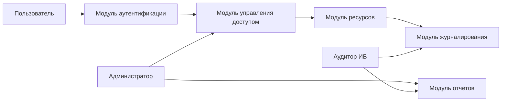
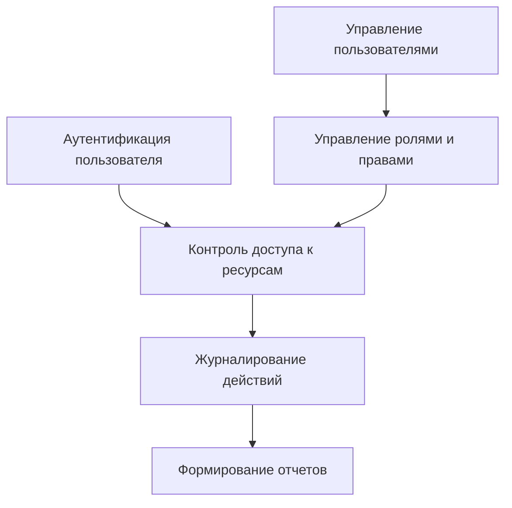
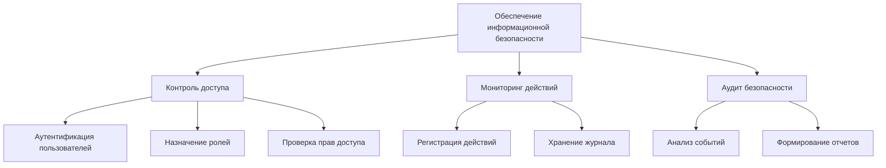

# Этап 1. Системный анализ предметной области

## 1. Обоснование выбора предметной области

Предметной областью проекта является **обеспечение информационной безопасности корпоративной информационной системы путем управления доступом пользователей к ресурсам и ведения журнала их действий**.

Актуальность данной предметной области обусловлена тем, что современные корпоративные информационные системы обрабатывают значительные объёмы конфиденциальных данных. Несанкционированный доступ, утечка информации или несанкционированные действия пользователей могут привести к финансовым потерям, нарушению законодательства и репутационным рискам.

Использование системы управления доступом позволяет:

* контролировать доступ пользователей к информационным ресурсам;
* ограничивать права пользователей в соответствии с их ролями;
* фиксировать действия пользователей;
* проводить аудит безопасности.

Таким образом, разработка модели системы управления доступом является важной задачей для обеспечения информационной безопасности организации.

# 2. Системный анализ

## Цель системы

Главная цель системы:

**Обеспечение информационной безопасности корпоративной информационной системы за счёт управления доступом пользователей и регистрации их действий.**

## Подсистемы

Система включает следующие подсистемы:

1. **Подсистема аутентификации**
2. **Подсистема управления доступом**
3. **Подсистема управления ресурсами**
4. **Подсистема журналирования действий**
5. **Подсистема формирования отчётов**

## Элементы системы

Основными элементами системы являются:

* пользователь;
* администратор системы;
* аудитор информационной безопасности;
* информационные ресурсы;
* роли пользователей;
* права доступа;
* журнал действий;
* отчёты безопасности.

## Связи между элементами

Основные связи:

* пользователь проходит **аутентификацию** в системе;
* пользователю назначается **роль**;
* роль определяет **права доступа**;
* права доступа регулируют взаимодействие пользователя с **ресурсами**;
* все действия пользователя фиксируются в **журнале событий**;
* на основе журнала формируются **отчёты для аудита**.

# 3. Морфологическое описание системы

Морфологическое описание определяет **состав и структуру системы**.

## Состав системы

Система состоит из следующих компонентов:

1. Модуль аутентификации
2. Модуль управления пользователями
3. Модуль управления ролями и правами
4. Модуль управления ресурсами
5. Модуль журналирования
6. Модуль формирования отчётов

## Структурная схема системы

Пример схемы:

# 4. Функциональное описание системы

Основные функции системы:

### 1. Аутентификация пользователей

Проверка учетных данных пользователя и предоставление доступа к системе.

### 2. Управление пользователями

Создание, изменение и удаление учетных записей.

### 3. Управление ролями и правами

Назначение ролей пользователям и определение прав доступа к ресурсам.

### 4. Контроль доступа к ресурсам

Проверка прав пользователя при обращении к информационным ресурсам.

### 5. Регистрация действий пользователей

Фиксация действий пользователей в журнале событий.

### 6. Формирование отчётов

Анализ журнала событий и создание отчетов по безопасности.

## Функциональная схема

# 5. Дерево целей

## Главная цель

**Обеспечение информационной безопасности корпоративной системы**

## Декомпозиция (3 уровня)

