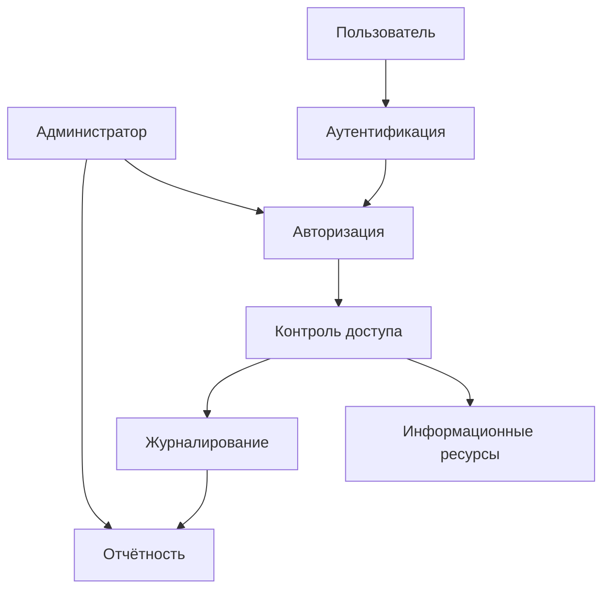
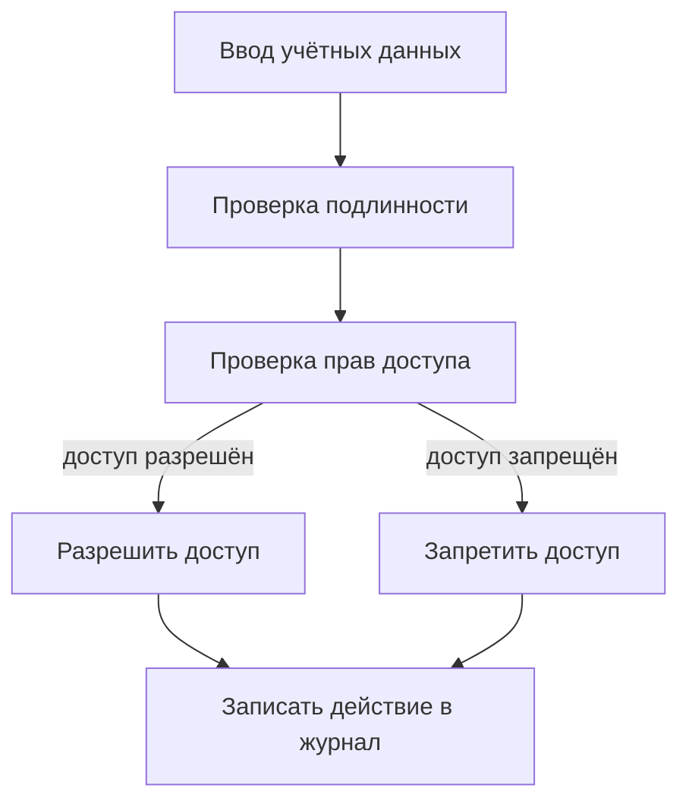
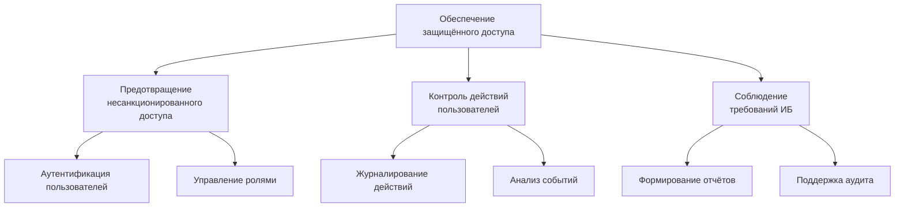

# Лабораторная работа №1

## Системный анализ предметной области

## 1. Выбор предметной области

**Предметная область:**  
Обеспечение информационной безопасности корпоративной информационной системы путём управления доступом пользователей к ресурсам и ведения журнала их действий.

**Краткое описание системы:**  
Система предназначена для аутентификации пользователей, разграничения прав доступа к информационным ресурсам, регистрации действий пользователей и формирования отчётов для целей контроля и аудита информационной безопасности.

## 2. Системный анализ предметной области

### 2.1 Цели системы

**Главная цель системы:**  
Обеспечение защищённого и контролируемого доступа пользователей к ресурсам корпоративной информационной системы.

**Подцели:**

- предотвращение несанкционированного доступа;
- реализация принципа минимальных привилегий;
- контроль действий пользователей;
- обеспечение возможности аудита и анализа инцидентов безопасности.
### 2.2 Подсистемы

В рамках системы выделяются следующие подсистемы:

1. Подсистема аутентификации пользователей
2. Подсистема авторизации и управления ролями
3. Подсистема контроля доступа к ресурсам
4. Подсистема журналирования действий
5. Подсистема отчётности и аудита

### 2.3 Элементы системы

Основные элементы системы:

- пользователь;
- администратор системы;
- роль;
- право доступа;
- ресурс информационной системы;
- сессия пользователя;
- запись журнала аудита.

### 2.4 Связи между элементами

- пользователь проходит аутентификацию и открывает сессию;
- пользователю назначаются роли;
- роли определяют набор прав доступа;
- права доступа применяются к ресурсам;
- действия пользователя фиксируются в журнале аудита;
- данные журнала используются для формирования отчётов.

### Структурная схема системы (mermaid)

## 3. Морфологическое и функциональное описание системы

### 3.1 Морфологическое описание

Морфологическое описание определяет возможные варианты реализации ключевых параметров системы.

|Параметр|Возможные значения|
|---|---|
|Тип пользователя|обычный пользователь, администратор|
|Способ аутентификации|логин–пароль, двухфакторная|
|Модель доступа|ролевая (RBAC)|
|Тип ресурса|файл, сервис, база данных|
|Журналирование|частичное, полное|
|Отчётность|по пользователю, по периоду, по ресурсу|

---

### 3.2 Функциональное описание

Основные функции системы:

- регистрация и аутентификация пользователей;
- назначение ролей и прав доступа;
- проверка прав при обращении к ресурсам;
- предоставление или запрет доступа;
- регистрация действий пользователя;
- формирование отчётов по безопасности.

### 📌 Функциональная схема (mermaid)

## 4. Дерево целей и декомпозиция главной цели

### 4.1 Дерево целей

Главная цель системы декомпозируется на подцели и задачи более низкого уровня.
### Дерево целей (mermaid)

## Выводы

В ходе выполнения лабораторной работы была выбрана и проанализирована предметная область информационной безопасности — система управления доступом пользователей. Проведён системный анализ, выделены цели, подсистемы, элементы и связи. Построены морфологическое и функциональное описания системы, а также дерево целей с декомпозицией главной цели.

Полученные результаты могут быть использованы в последующих лабораторных работах для построения DFD, ER-, UML-, IDEF0- и BPMN-диаграмм.
